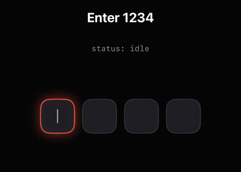

# OTPAnimatedField

[](LICENSE)
[](OTPAnimatedField.swift)
[](OTPAnimatedField.swift)

A SwiftUI one-time-code (OTP) input whose boxes **become the loading indicator**.
When the code is submitted, the boxes fly from the row onto a circle and orbit it
while you verify the code. On success they collapse into a check mark; on failure
they return to the row, shake, and clear for another try.

<p align="center">
  
</p>

## Features

- **One continuous animation** from typing → loading → result, so no separate spinner.
- **`async` verification**: return `Bool` from `onVerify`, or drive the result
  yourself through a controller (view model, TCA, button…).
- **Real text input**: a hidden `TextField` handles the number pad, hardware keyboards,
  backspace and **SMS autofill** (`.oneTimeCode`).
- **Arabic-Indic digits** (`١٢٣٤`) and other script digits are accepted and normalized to `1234`.
- **Fits any width**: boxes shrink for 6- or 8-digit codes on small screens, and the
  orbit widens for longer codes so the boxes never collide.
- **Colors from the call site** with `.otpFieldColors(...)`, plus light/dark presets.
- **Accessible**: VoiceOver label and status announcements, respects Reduce Motion,
  digits stay left-to-right in RTL layouts, success/error haptics.
- **Single file, no dependencies.**

## Requirements

iOS 17+, Swift 6 (Xcode 16 or newer).

## Installation

Download [`OTPAnimatedField.swift`](OTPAnimatedField.swift) and drag it into your Xcode project.
That's the whole component: one file, no dependencies.

## Usage

```swift
OTPAnimatedField(
    length: 4,
    autofocus: true,
    onVerify: { code in
        try await api.verifyOTP(code)          // async -> Bool
    },
    onVerified: { _ in
        router.showHome()                      // runs after the check-mark animation
    }
)
```

Typing the last digit submits the code. Return `true` for the success animation and
`false` (or throw) for the error animation. By default a rejected code is cleared
after the shake so the user can try again. The boxes keep orbiting for at least
`minimumVerifyingDuration` (1.5 s) so a fast backend doesn't cut the animation short.

### Driving it yourself

Leave out `onVerify` and resolve the result through `OTPFieldController`:

```swift
@State private var otp = OTPFieldController()

OTPAnimatedField(length: 6, controller: otp, onCompleted: { code in
    viewModel.verify(code)
})

// later, when the result arrives
otp.succeed()   // orbit → check mark
otp.fail()      // orbit → row, shake, back to idle
```

### Verify button

```swift
OTPAnimatedField(controller: otp, autoVerify: false, onVerify: verify)

Button("Verify") { otp.verify() }   // an incomplete code just shakes
```

| Controller | Effect |
| --- | --- |
| `code` | Read or set the entered code. |
| `status` | `.idle`, `.verifying`, `.success` or `.error`. |
| `verify()` | Submit the code and move the boxes into orbit. |
| `succeed()` | Collapse the boxes into the check mark. |
| `fail()` | Return the boxes to the row, shake, then go back to `.idle`. |
| `reset(clearCode:)` | Back to an empty row from any state (e.g. after "Resend code"). |

## Colors

With nothing set, the field uses the dark or light preset that matches the color scheme.
Change any color where you use the field; anything you leave out keeps the preset:

```swift
OTPAnimatedField(length: 4, onVerify: verify)
    .otpFieldColors(
        accent: .blue,              // focused box, orbit and dots
        fill: Color("OtpFill"),     // box background (asset colors adapt to light/dark)
        border: .gray.opacity(0.3),
        text: .primary,
        ring: .secondary,
        cursor: .blue,
        error: .red,
        success: .mint              // check mark
    )
```

The modifier works on any parent view too, so one call can style every OTP field on a screen.

## Full style

For sizes and timings, pass an `OTPFieldStyle`:

```swift
var style = OTPFieldStyle.dark(accent: .orange)
style.boxSize = 64
style.cornerRadius = 20
style.orbitPeriod = 2.0
style.fontDesign = .monospaced

OTPAnimatedField(length: 4, style: style, onVerify: verify)
```

| Property | Default |
| --- | --- |
| `boxSize`, `gap`, `cornerRadius`, `borderWidth` | 58, 12, 16, 1.5 |
| `glowRadius` | 18 |
| `orbitBoxScale`, `orbitRadius` | 0.64, automatic |
| `fontSize`, `fontWeight`, `fontDesign` | 24, `.semibold`, `.rounded` |
| `morphDuration`, `orbitPeriod` | 0.7 s, 2.6 s |
| `errorDuration`, `successDuration`, `styleDuration` | 0.9 s, 1.0 s, 0.22 s |

## Other options

| Parameter | Default | |
| --- | --- | --- |
| `length` | 4 | Number of digits. |
| `autofocus` | `false` | Focus and show the keyboard on appear. |
| `autoVerify` | `true` | Submit when the last digit is typed. |
| `clearsOnError` | `true` | Clear the code after the error animation. |
| `reservesOrbitSpace` | `true` | Reserve the orbit's height so content below doesn't move. |
| `obscuringCharacter` | `nil` | e.g. `"•"` to hide the digits. |
| `hapticFeedback` | `true` | Haptics on success and error. |
| `minimumVerifyingDuration` | 1.5 s | Minimum orbit time. |
| `keyboardType` | `.numberPad` | Other keyboards accept any characters. |
| `labels` | English | `OTPFieldLabels` for VoiceOver; pass localized strings. |
| `onChanged`, `onCompleted`, `onStatusChanged`, `onFailed` | | Callbacks. |

## Performance

- Every animation is computed from time in a single `TimelineView`, which **pauses
  when nothing moves**, so an idle field renders no frames.
- Boxes move with `offset`, `scaleEffect` and `opacity`, which are render-time
  effects with no layout pass per frame.
- Box views are `Equatable`, so they're skipped on frames where their state hasn't changed.
- The rings, dots and check mark are drawn in one `Canvas`.

## Example

Open [`Example/OTPDemo.xcodeproj`](Example/OTPDemo.xcodeproj). The demo accepts `1234`
(or `123456` / `12345678`) and lets you switch length, theme and colors. Set your team
under *Signing & Capabilities* to run it on a device.

## License

[MIT License](LICENSE).
